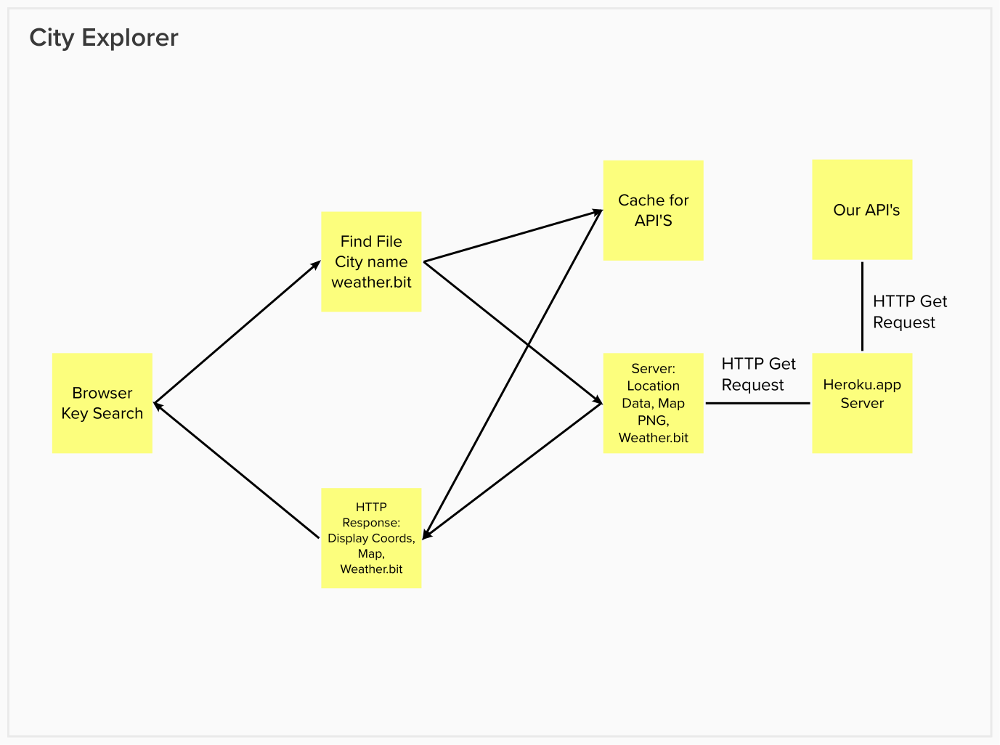

# Project Name

**Author**: Ian Forrester
**Version**: 1.0.3 (increment the patch/fix version number if you make more commits past your first submission)

## Overview

- A basic map website able to display an image of the location, along with the coordinates, movies, and weather

## Getting Started

- Added a back-end server, for displaying weather and movies on various cities

## Architecture

## Change Log

09-26-2022 4:59pm - Application now has a semi-functional server.

## Credit and Collaborations

- Sage Jasinski, Julian Barker, Chris Fanucchi

## Name of feature: Implemented map and Search

- Estimate of time needed to complete: 4 hrs

- Start time: 3:30pm

- Finish time: 7:50pm

- Actual time needed to complete: 4hrs

## Name of feature: Server setup with WeatherBit, MovieDB

- Estimate of time needed to complete: 4 hrs

- Start time: 3:30pm

- Finish time: 9:50pm

- Actual time needed to complete: 6hrs

